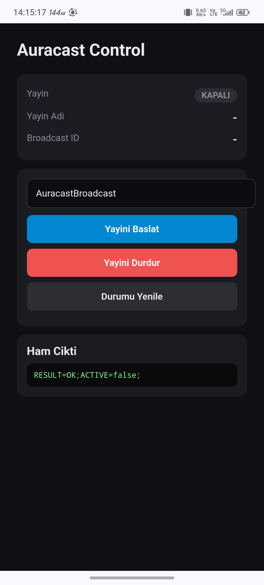
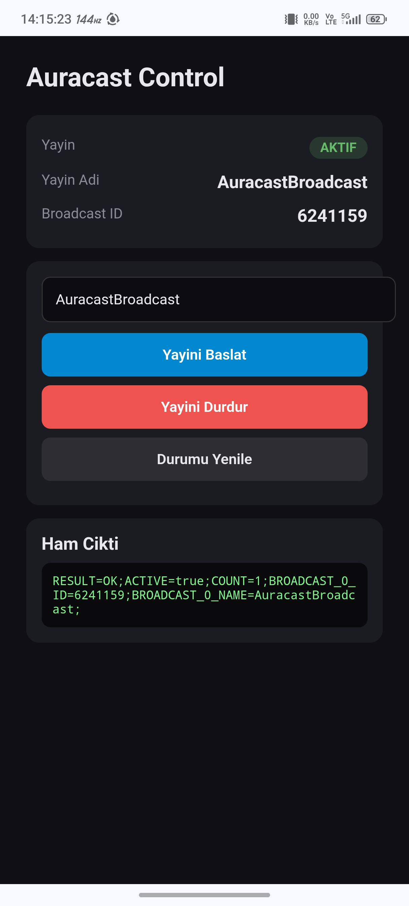

# AuracastControl

**RedMagic 11 Pro** için **Auracast (LE Audio Broadcast)** yayınlarını zahmetsizce yönetin.  
KernelSU entegrasyonu sayesinde **WebUI** üzerinden tek dokunuşla yayın başlatın, durdurun ve yapılandırın.

## Neden AuracastControl?

RedMagic OS (Nubia), donanım desteklemesine rağmen Auracast arayüzünü kaldırmıştır. Bu modül, sistemin derinliklerindeki Bluetooth API'lerine erişerek bu engeli ortadan kaldırır. Artık **karmaşık komutlara veya harici araçlara gerek kalmadan** Auracast'i tam anlamıyla kullanabilirsiniz.

> 🚀 **Öne çıkanlar:**  
> - **Tek tıkla yayın başlat/durdur** – WebUI arayüzünden anında kontrol.  
> - **Güvenli bağlantı** – İsteğe bağlı yayın kodu ile yetkisiz erişimi engelleyin.  
> - **Zengin metadata** – Yayın adı ve dil bilgisini özelleştirin.  
> - **Uyumlu cihaz keşfi** – JBL Headphones gibi destekleyen cihazları otomatik tarama moduna alın.  
> - **Kalıcı ayarlar** – Tüm yapılandırma `/data/adb/` altında saklanır, yeniden başlatmada kaybolmaz.

## Ekran Görüntüleri

## Kurulum

1. ZIP dosyasını indirin.  
2. **KernelSU** uygulamasını açın.  
3. **Modüller** sekmesine gidin.  
4. **Yükle**'ye dokunun ve ZIP dosyasını seçin.  
5. Cihazınızı **yeniden başlatın**.  
6. KernelSU → Modüller → **AuracastControl** üzerine dokunarak WebUI'yi açın.

## WebUI Kullanımı

Kullanıcı dostu arayüz sayesinde hiçbir teknik bilgiye ihtiyaç duymadan:

- Yayın durumunu görüntüleyebilir,  
- Tek dokunuşla yayın başlatıp durdurabilir,  
- Yayın kodu belirleyebilir,  
- Metadata alanlarını düzenleyebilir,  
- Mevcut yayınları tarayabilirsiniz.

## Teknik Detaylar

Modül, aşağıdaki sistem bileşenleriyle iletişim kurar:

- `android.bluetooth.IBluetoothManager` Binder servisi  
- Gizli `IBluetooth` arayüzü ve `startLeAudioBroadcast` metodu  
- `android.bluetooth.action.LE_AUDIO_BROADCAST_STATE_CHANGED` intent'i  
- JBL Headphones uygulamasının Auracast ekranını tetikleme

> Bu sayede, stok ROM'da kapalı olan Auracast işlevselliği tamamen açığa çıkar.

## Uyumluluk

- **Test edilen cihaz:** RedMagic 11 Pro  
- **Gereksinim:** KernelSU root, Android 13 veya üzeri  
- **Diğer cihazlar:** Test edilmemiştir; donanım/yazılım farklılıkları nedeniyle çalışmayabilir.

## Uyarı ve Sorumluluk Reddi

**KULLANIM RİSKİ SİZE AİTTİR.**

- Bu modül, düşük seviyeli Bluetooth sistem servislerine müdahale eder.  
- Cihazınızda işlev kaybı, kararsızlık veya başka sorunlar oluşabilir.  
- Geliştirici hiçbir zarardan sorumlu tutulamaz.  
- Bu proje **eğitim ve araştırma amaçlıdır**.

**Yüklemeden önce mutlaka yedek alın.**
